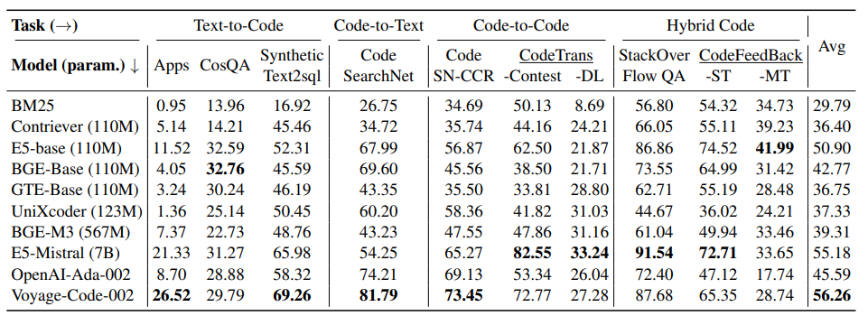

# содержание
1. блок определений
	1. лексический поиск
	2. семантический поиск
	3. гибридный поиск
	4. поиск по коду (code information retrieval)
2. статья по coir
3. поиск других статей, где модели сравниваются по code retrieval
4. выводы

# определения
## лексический поиск
Лексический поиск — метод поиска информации, при котором поисковая система сопоставляет запрос пользователя с документами по точным словам или фразам.

В простой форме лексический поиск только находит конкретные ключевые слова без дополнительной обработки, фокусируясь на точном совпадении или близких вариантах в тексте.

## семантический поиск
Семантический поиск — это технология поиска информации, основанная на использовании контекстного значения запрашиваемых фраз вместо словарных значений отдельных слов или выражений при поисковом запросе.

Поисковая система анализирует не просто отдельные слова, а их взаимосвязь и смысл в контексте.

## гибридный поиск
Гибридный поиск — это объединение лексического и семантического поисков для выявления результатов, которые напрямую и контекстно соответствуют запросу пользователя.

Каждый метод поиска выполняется отдельно. Полнотекстовый поиск ищет определённые слова или фразы в контенте, семантический — понимает контекст или смысл запроса, а не конкретные используемые слова.
 
Результаты каждого метода объединяются в единый список. Это происходит с помощью процесса, известного как «слияние». Система может отдавать приоритет определённым результатам на основе таких факторов, как их релевантность поисковому запросу, их рейтинг в отдельных списках и другие критерии.

## поиск кода (code information retrieval)
Поиск по коду - подзадача поиска информации, фокусирующаяся на поиске кода на различных языках программирования. Поиск по коду важен для ускорения процессов разработки и улучшения качества кода. Эффективный поиск по коду помогает разработчикам находить код по описанию, объяснения искомого кода, анализировать баги, находить саммари по коду и искать похожие блоки кода

# роль бенчмарков в поиске кода
`-`

# статья по coir

https://arxiv.org/pdf/2407.02883 - статья
https://github.com/CoIR-team/coir/ - github
https://huggingface.co/CoIR-Retrieval - hf
https://archersama.github.io/coir/ - лидерборд

CoIR (Code Information Retrieval benchmark) - бенчмарк различных моделей 
последняя версия статьи (v3) вышла 6 июня 2025 года

на момент написания лидерами были проприетарные модели voyage-code-002 (NDCG@10 56.26 в среднем) и e5-mistral (NDCG@10 55.28 в среднем)

статья coir показала, что на тот момент только большие закрытые модели могут лидировать
# анализ статей
## про модели

### CodeXEmbed

8 августа, 2025 года

выход v3 статьи "CodeXEmbed: A Generalist Embedding Model Family for Multiligual and Multi-task Code Retrieval" (https://arxiv.org/pdf/2411.12644), в которой модель показала прирост в 20% по сравнению с предыдущими лидерами. Модель имеет от 400m до 7b параметров. При этом даже самая маленькая модель из списка показывает результаты лучше, чем у лучших проприетарных моделей

таким образом, модель CodeXEmbed7b достигла показателя в 78.20 (в среднем)

![[Pasted image 20260111172204.png]]

модель доступна на hf
https://huggingface.co/papers/2411.12644

---

### CODESAGE

2 февраля 2024 года

выход статьи "Code Representation Learning At Scale" (https://arxiv.org/abs/2402.01935, https://huggingface.co/codesage).
модели CODESAGE имеют от 130М до 1.3В параметров
в статье модель тестировалась не на бенчмарке coir, но ее результаты в нем будет видно в общей сводке

в статье приводится таблица, в которой видно, что даже малые модели могут достичь уровня, сравнительного с проприетарными лидерами бенчмарков

![[Pasted image 20260111173302.png]]

## сравнение

https://archersama.github.io/coir/
leaderboard coir содержит текущие показатели моделей в общем своде
![[Pasted image 20260111173427.png]]

в этой сравнительной таблице не указаны результаты CodeXEmbed 7b, но хорошо видно, что даже модель на 2b занимает верхнюю строчку рейтинга

Но более замечательный факт заключается в том, что модель на 400М в действительности занимает строчку выше, чем E5-Mistral, у которой целых 7b параметров (61.89 против 55.18). Это подтверждает, что малые encoder модели могут иметь лучшие показатели, чем большие llm

## остальное интересное

### группа 1 -  новые легковесные модели (encoder-only)

#### Post-Training Quantization of OpenPangu Models for Efficient Deployment on Atlas A2
https://arxiv.org/abs/2512.23367
8 января 2026
новая легковесная модель openPangu-Embedded-1B. Это современный легковесный энкодер (всего 1 млрд параметров), ориентированный на встраиваемые системы. Подтверждает актуальность создания эффективных поисковых моделей

### группа 2 - структурный и гибридный поиск

новые подходы к retrieval information
#### In Line with Context: Repository-Level Code Generation via Context Inlining
https://arxiv.org/abs/2601.00376
1 января 2026
Предлагает новый вид гибридизации: Retrieval + Context Inlining. Вместо слепого поиска, модель подтягивает зависимости кода

#### GRACE: Graph-Guided Repository-Aware Code Completion through Hierarchical Code Fusion
https://arxiv.org/abs/2509.05980
7 сентября 2025
Демонстрирует ограниченность чистого векторного поиска и предлагает использовать графы для понимания структуры репозитория

### группа 3 - аугментация и контекст

#### LAURA: Enhancing Code Review Generation with Context-Enriched Retrieval-Augmented LLM
https://arxiv.org/abs/2512.01356
1 декабря 2025
Пример Context-Enriched Retrieval. Найденный код аугментируется дополнительным контекстом перед подачей в LLM для улучшения качества генерации.

#### RepoShapley: Shapley-Enhanced Context Filtering for Repository-Level Code Completion
https://arxiv.org/abs/2601.03378
6 января 2026
Решает проблему "шума" в поиске. Использует теорию игр для фильтрации результатов

# прочее (ссылки, списки и т.д.)
Revela: Dense Retriever Learning via Language Modeling
https://arxiv.org/abs/2506.16552

A Comparative Study of Specialized LLMs as Dense Retrievers
https://arxiv.org/abs/2507.03958

Completion by Comprehension: Guiding Code Generation with Multi-Granularity Understanding
https://arxiv.org/abs/2512.04538

Reformulate, Retrieve, Localize: Agents for Repository-Level Bug Localization
https://arxiv.org/abs/2512.07022

In Line with Context: Repository-Level Code Generation via Context Inlining
https://arxiv.org/abs/2601.00376

RepoShapley: Shapley-Enhanced Context Filtering for Repository-Level Code Completion
https://arxiv.org/abs/2601.03378

An Empirical Evaluation of LLM-Based Approaches for Code Vulnerability Detection: RAG, SFT, and Dual-Agent Systems
https://arxiv.org/abs/2601.00254
