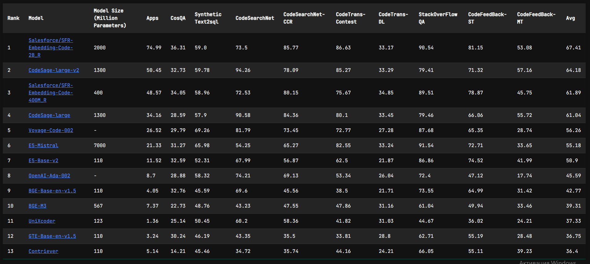

<h1>Аналитический обзор методов поиска кода</h1>

# содержание

1. введение
2. блок определений
	1. лексический поиск
	2. семантический поиск
	3. гибридный поиск
	4. поиск по коду (code information retrieval)
3. статья по coir
4. поиск других статей, где модели сравниваются по code retrieval
5. выводы

# введение

С появлением LLM поиск кода (code retrieval) стал перспективным направлением для таких методов, как, например, RAG. Эффективность и скорость работы во многом определяет качество ответа языковой модели. В данном тексте представлен анализ современных подходов к этой задаче. Рассмотрены ключевые методы от классических лексических до SOTA-моделей 2026 года. Проанализирован бенчмарк CoIR и его результаты. Основной фокус - на encoder only llm  и гибридных методах 

# определения
## лексический поиск
Лексический поиск — метод поиска информации, при котором поисковая система сопоставляет запрос пользователя с документами по точным словам или фразам

В простой форме лексический поиск только находит конкретные ключевые слова без дополнительной обработки, фокусируясь на точном совпадении или близких вариантах в тексте

В контексте поиска кода лексический поиск важен для нахождения точных названий переменных, функций и т.д.

## семантический поиск
Семантический поиск — это технология поиска информации, основанная на использовании контекстного значения запрашиваемых фраз вместо словарных значений отдельных слов или выражений при поисковом запросе

Поисковая система анализирует не просто отдельные слова, а их взаимосвязь и смысл в контексте.

Благодаря своей архитектуре позволяет находить, например, реализацию функционала по описанию, text-to-code. Работает даже если запрос не содержит точных названий искомого функционала

## гибридный поиск
Гибридный поиск — это объединение лексического и семантического поисков для выявления результатов, которые напрямую и контекстно соответствуют запросу пользователя

Каждый метод поиска выполняется отдельно. Полнотекстовый поиск ищет определённые слова или фразы в контенте, семантический — понимает контекст или смысл запроса, а не конкретные используемые слова
 
Результаты каждого метода объединяются в единый список. Это происходит с помощью процесса, известного как «слияние». Система может отдавать приоритет определённым результатам на основе таких факторов, как их релевантность поисковому запросу, их рейтинг в отдельных списках и другие критерии

Является наиболее перспективным из-за сочетания преимуществ лексического и семантического поисков

## поиск кода (code information retrieval)
Поиск по коду - подзадача поиска информации, фокусирующаяся на поиске кода на различных языках программирования. Поиск по коду важен для ускорения процессов разработки и улучшения качества кода. Эффективный поиск по коду помогает разработчикам находить код по описанию, объяснения искомого кода, анализировать баги, находить саммари по коду и искать похожие блоки кода

# роль бенчмарков в поиске кода
`-`

# статья по coir

[статья на arxiv](https://arxiv.org/pdf/2407.02883)
[github](https://github.com/CoIR-team/coir/)
[huggingface](https://huggingface.co/CoIR-Retrieval)
[лидерборд](https://archersama.github.io/coir/)

CoIR (Code Information Retrieval benchmark) - бенчмарк различных моделей 
последняя версия статьи (v3) вышла 6 июня 2025 года

На момент написания лидерами были проприетарные модели, как voyage-code-002 (NDCG@10 56.26 в среднем), и крупные дистиллированные llm, как e5-mistral (NDCG@10 55.28 в среднем)

рис. 1 - сравнительная таблица моделей из статьи CoIR

CoIR выявил главную проблему на момент выхода - лишь проприетарные и заметно более крупные opensource модели имеют преимущество. Легковесные модели имели значительно более низкие результаты
# анализ статей
## про модели

### CodeXEmbed

8 августа, 2025 года

Выход v3 статьи "CodeXEmbed: A Generalist Embedding Model Family for Multiligual and Multi-task Code Retrieval" ([arxiv](https://arxiv.org/pdf/2411.12644)), в которой модель показала прирост в 20% по сравнению с предыдущими лидерами. Модель имеет от 400m до 7b параметров. При этом даже самая маленькая модель из списка показывает результаты лучше, чем у лучших проприетарных моделей

Таким образом, модель CodeXEmbed7b достигла показателя в 78.20 (в среднем)

рис. 2 - сравнительная таблица из статьи CodeXEmbed

Модель доступна на hf
[huggingface](https://huggingface.co/papers/2411.12644)

Выход CodeXEmbed показал, что результаты CoIR были устаревшими, т.к. показал, что модель имеет на 39% большую точность, чем предыдущий лидер Voyage-Code-002

---

### CODESAGE

2 февраля 2024 года

Выход статьи "Code Representation Learning At Scale" ([arxiv](https://arxiv.org/abs/2402.01935), [huggingface](https://huggingface.co/codesage)).
Модели CODESAGE имеют от 130М до 1.3В параметров.
В статье модель тестировалась не на бенчмарке coir, но ее результаты в нем будет видно в общей сводке

В статье приводится таблица, в которой видно, что даже малые модели могут достичь уровня, сравнительного с проприетарными лидерами бенчмарков

рис. 3 - сравнительная таблица из статьи CODESAGE

## сравнение

[лидерборд](https://archersama.github.io/coir/)
Leaderboard coir содержит текущие показатели моделей в общем своде

рис. 4 - сравнительная таблица из лидерборда CoIR

В этой сравнительной таблице не указаны результаты CodeXEmbed 7b, но хорошо видно, что даже модель на 2b занимает верхнюю строчку рейтинга

==Но более замечательный факт заключается в том, что модель на 400М в действительности занимает строчку выше, чем E5-Mistral, у которой целых 7b параметров (61.89 против 55.18). Это подтверждает, что для задачи поиска кода архитектура является более важной, чем размерность модели==

| #   | Модель          | Результат (avg) |
| --- | --------------- | --------------- |
| 1   | CodeXEmbed 2b   | 67.41           |
| 3   | CodeSage 1.3b   | 64.18           |
| 3   | CodeXEmbed 400m | 61.89           |
| 6   | E5-Mistral 7b   | 55.18           |
| 7   | E5-Base-v2 110m | 50.9            |
табл. 1 - сравнительная таблица наиболее интересных выводов

## Обзор перспективных направлений (2025–2026)

### группа 1 -  новые легковесные модели (encoder-only)

Подтверждает тренд на минимизацию моделей для локального запуска
#### Post-Training Quantization of OpenPangu Models for Efficient Deployment on Atlas A2
[arxiv](https://arxiv.org/abs/2512.23367)
8 января 2026
Новая легковесная модель openPangu-Embedded-1B. Это современный легковесный декодер (LLM) (всего 1 млрд параметров), ориентированный на встраиваемые системы. Альтернатива для энкодеров - дистиллированные llm

### группа 2 - структурный и гибридный поиск

Новые подходы к retrieval information. Указывают на то, что следующий шаг развития — это учет структуры кода, например, графы и зависимости, а не просто текста
#### In Line with Context: Repository-Level Code Generation via Context Inlining
[arxiv](https://arxiv.org/abs/2601.00376)
1 января 2026
Предлагает новый вид гибридизации: Retrieval + Context Inlining. Вместо слепого поиска, модель подтягивает зависимости кода

#### GRACE: Graph-Guided Repository-Aware Code Completion through Hierarchical Code Fusion
[arxiv](https://arxiv.org/abs/2509.05980)
7 сентября 2025
Демонстрирует ограниченность чистого векторного поиска и предлагает использовать графы для понимания структуры репозитория

### группа 3 - аугментация и контекст

Демонстрирует потенциал методов пре- и пост-обработки (аугментация запроса и фильтрация выдачи)

#### LAURA: Enhancing Code Review Generation with Context-Enriched Retrieval-Augmented LLM
[arxiv](https://arxiv.org/abs/2512.01356)
1 декабря 2025
Пример Context-Enriched Retrieval. Найденный код аугментируется дополнительным контекстом перед подачей в LLM для улучшения качества генерации.

#### RepoShapley: Shapley-Enhanced Context Filtering for Repository-Level Code Completion
[arxiv](https://arxiv.org/abs/2601.03378)
6 января 2026
Решает проблему "шума" в поиске. Использует теорию игр для фильтрации результатов

# выводы и предложения по экспериментам

## выбор основной модели - Salesforce/SFR-Embedding-Code-400M_R

Для замеров результатов и построения гибридного поиска наиболее перспективной выглядит модель CodeXEmbed 400m

Причиной является ее легковесность. Она занимает 3-е место в текущем рейтинге CoIR, уступая только довольно большим моделям, являясь encoder-only моделью с малой размерностью, что позволяет быстро проводить эксперименты и использовать ее в большем количестве реальных сценариев

## дополнительная модель - E5-Base-v2

В качестве эталона для сравнения предлагается использовать модель E5-Base-v2 110m

Причиной является ее огромная эффективность - всего при 110m параметров модель показывает результат в 50.9

Ее сравнение с CodeXEmbed покажет, стоит ли четырехкратный прирост размера увеличения среднего результата на 11 пунктов

## направление исследования

Анализ статей и лидерборда CoIR показал, что все модели сравнивались только в чистом виде, исключительно как encoder-only

Реализация гибридного поиска на основе CodeXEmbed & bm25 покажет, насколько сильно гибридный поиск на основе SOTA-решений может оказаться эффективным. Данный эксперимент обладает элементом научной новизны, т.к. в бенчмарке таких решений не представлено
