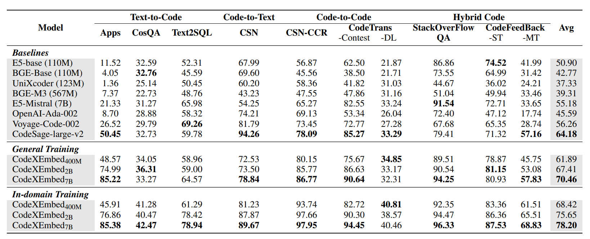

Во многом я основывался на предыдущей суммаризации всего, что я нашел по моделям и бенчмаркам - [github](https://github.com/camtimhamilton/course_hybrid_search/blob/main/course%202-1%20for%20gh.md)
# Инфа про конфу

[source](https://nnov.hse.ru/studentconf/abstracts22)

Срок подачи заявки - до 15 марта. Результат (приняли или нет) - 1-5 апреля

Для регистрации надо:
- аннотация доклада в 200-300 слов. В ней должны быть мотивация, цель, методы исследования и результаты
- подписанная и отсканированная рекомендация от научного руководителя (pdf/jpg). [форма](https://nnov.hse.ru/mirror/pubs/share/1110804160.docx)
- после подтверждения о включении доклада в программу конференции - нужен файл с тезисами доклада (word) на почту akozlov@hse.ru. [Примеры](https://nnov.hse.ru/mirror/pubs/share/1110803868.docx)

Требования к тезисам:
- от 3 до 5 печатных страниц
- word, Times New Roman, кегль 12, межстрочный интервал 1.15 с выравниванием по ширине. Поля: верхнее и нижнее по 2 см, левое 3 см, правое 1.5 см
- полный список оформления есть на сайте. Там очень много всего

Постер делается по шаблону - [шаблон](https://nnov.hse.ru/mirror/pubs/share/1012662109.pptx)

# Список задач

Для конференции для аннотации уже должны быть методы, исследования и их результаты. Значит, до 15 марта все это уже должно быть, но желательно раньше, первые числа марта

После этого согласование аннотации и рекомендация

То есть нужно:
- до конца февраля - черновой вариант исследования, готовые шаблоны для графиков
- до 10 марта - подготовить и согласовать аннотацию и получить рекомендацию
- после 5 апреля - подготовить тезисы и постер

# Зачем нам новый CoIR - обоснование исследования

CoIR является стандартом для оценки моделей поиска кода, который предоставил унифицированный набор задач. Но бенчмарк CoIR и его методология все больше отрываются от реальных промышленных систем

На практике компании (IDE, поисковики) работают не с чистым векторным поиском, а с использованием всей эффективности внедрения пайплайнов

# Доказательства необходимости

Идем по хронологии
## 6 июня 2025 года - выход v3 версии статьи по CoIR

[статья на arxiv](https://arxiv.org/pdf/2407.02883)
[github](https://github.com/CoIR-team/coir/)
[huggingface](https://huggingface.co/CoIR-Retrieval)
[лидерборд](https://archersama.github.io/coir/)

На момент написания лидерами были проприетарные модели, как voyage-code-002 (NDCG@10 56.26 в среднем), и крупные дистиллированные llm, как e5-mistral (NDCG@10 55.28 в среднем)

рис. 1 - сравнительная таблица моделей из статьи CoIR

CoIR выявил главную проблему на момент выхода - лишь проприетарные и заметно более крупные opensource модели имеют преимущество. Легковесные модели имели значительно более низкие результаты

## 8 августа 2025 года - выход v3 версии статьи по CodeXEmbed

[arxiv](https://arxiv.org/pdf/2411.12644)
[huggingface](https://huggingface.co/papers/2411.12644)

Модель показала прирост в 20% по сравнению с предыдущими лидерами. Модель имеет от 400m до 7b параметров. При этом даже самая маленькая модель из списка показывает результаты лучше, чем у лучших проприетарных моделей

Таким образом, модель CodeXEmbed7b достигла показателя в 78.20 (в среднем)

рис. 2 - сравнительная таблица из статьи CodeXEmbed

Выход CodeXEmbed показал, что результаты CoIR были устаревшими, т.к. показал, что модель имеет на 39% большую точность, чем предыдущий лидер Voyage-Code-002

## Промежуточный вывод

Прогресс в моделях есть, он виден, но методология даже на текущий момент прежняя и основывается лишь на базовом CoIR

В статьях ниже я покажу, что на текущий момент существуют эффективные пайплайны, которые CoIR по большей мере не способен показать

## Гибридный поиск

Является стандартом де-факто, но редко измеряется в бенчмарках в связке с SOTA-моделями. В статьях и лидербордах по CoIR не представлен

## Структурная фильтрация

Статьи, такие как InlineCoder (январь, 2026) [arxiv](https://arxiv.org/abs/2601.00376), показывают, что учет структуры кода (графы, зависимости) — следующий шаг эволюции. Пайплайн с SQL-фильтрацией — это практическая реализация этой идеи

## Аугментация кода

Работы вроде LAURA (декабрь, 2025) [arxiv](https://arxiv.org/abs/2512.01356) доказывают, что обогащение контекста (Context-Enriched Retrieval) значительно повышает качество

## Вывод

Новейшие научные статьи показывают значительное несоответствие уровня реализации и уровня бенчмарков для сравнения моделей. Таким образом CoIR можно назвать неактуальным для практического сравнения моделей

# Исследование

Расширение Методологии CoIR для оценки моделей в целостных поисковых стратегиях - пайплайнах

Цель - доказать через эксперименты, что:
1. Лидерборд изменится. Модели поменяют свои относительные позиции и расстояние в баллах между собой
2. Эффективность связки и методологий важнее размерности модели

То есть, исследование призвано не просто просмотреть и сравнить текущие модели и методы их оценки, предложить новый, более релевантный способ оценки систем поиска кода
