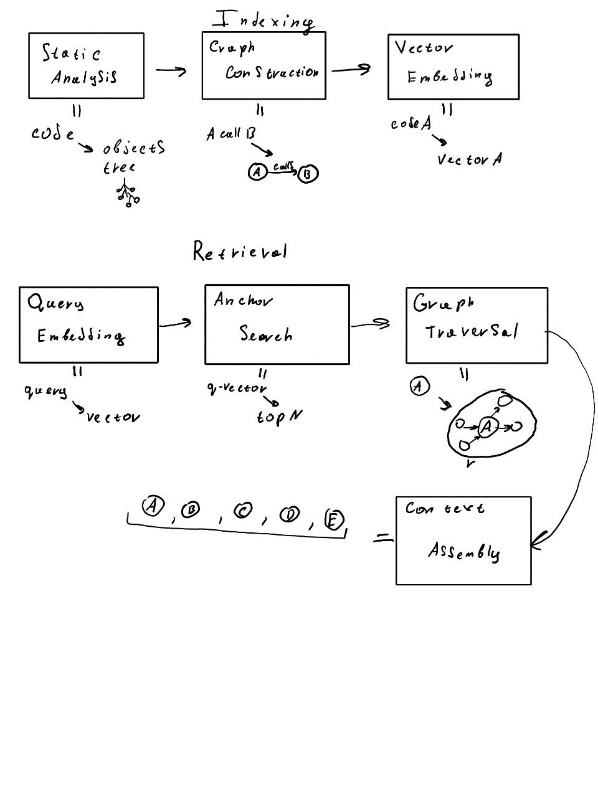

# code retrieval

https://arxiv.org/abs/2602.05550
собственный бенчмарк от ребят из итмо. Взяли модели энкодеров, использовали аугментацию кода метаданными, потом дообучили, используя контрастивное обучение (Multiple Negatives Ranking Loss)

https://arxiv.org/abs/2602.05892
бенчмарк для оценки агентов. В целом - есть много общего

Главное, с чем столкнулся - в проде используется не только поиск релевантного чанка, но и само разбиение на чанки. Для графового поиска такое необходимо. Без этого невозможно его использовать

плюс становятся невозможными такие идеи как:
1. проверка логичности и связности ответа
2. метрики эффективности. Насколько много лишнего нашла модель
3. использование в качестве верного не 1 чанка, а структуры
4. построение полной структуры кода, чтобы по ней искать, а не отдельных чанков


https://arxiv.org/abs/2601.11124
статья про дообучение энкодеров. Можно взять метрики и идеи

https://arxiv.org/abs/2512.05411
добавление метаданных с помощью llm

https://arxiv.org/abs/2602.03400
фильтрация метаданных

https://arxiv.org/abs/2409.14609
создание метаданных с помощью регулярок
# repository-level code retrieval



## Reliable Graph-RAG for Codebases: AST-Derived Graphs vs LLM-Extracted Knowledge Graphs

https://arxiv.org/abs/2601.08773
Использование AST для построения графа
Таким образом Граф всегда строится одинаково
## GraphCoder: Enhancing Repository-Level Code Completion via Code Context Graph-based Retrieval and Language Model

https://arxiv.org/abs/2406.07003
Пайплайн поиска - это поиск якоря, затем поиск соседей

## RepoGraph: Enhancing AI Software Engineering with Repository-level Code Graph

https://arxiv.org/abs/2410.14684
Идея межфайловых связей - граф строится в пределах всего репозитория. Функции разных файлов взаимосвязаны


## Context-Augmented Code Generation Using Programming Knowledge Graphs

https://arxiv.org/abs/2601.20810
Ограничение в виде радиуса поиска. Мы не идем дальше n связи. Таким образом сохраняем пямять

## Knowledge Graph Based Repository-Level Code Generation
https://arxiv.org/abs/2505.14394

# другие статьи

## Repository Intelligence Graph: Deterministic Architectural Map for LLM Code Assistants

https://arxiv.org/abs/2601.10112


# Код для графов

```python
import ast
import os
import networkx as nx
import chromadb
from sentence_transformers import SentenceTransformer
from collections import defaultdict


TARGET_REPO_PATH = r"E:\python\rlcr_graph\requests"


class RealWorldGraphBuilder:
    def __init__(self):
        self.graph = nx.DiGraph()
        
        
        self.symbol_map = defaultdict(list) 

    def _get_node_id(self, filepath, class_name, func_name):
        
        rel_path = os.path.relpath(filepath, start=os.getcwd())
        if class_name:
            return f"{rel_path}::{class_name}::{func_name}"
        return f"{rel_path}::{func_name}"

    def parse_repo(self, root_path):
        print(f"Parsing repository: {root_path} ...")
        
        
        for subdir, _, files in os.walk(root_path):
            for file in files:
                if not file.endswith(".py"): continue
                if "test" in file: continue 
                
                filepath = os.path.join(subdir, file)
                self._parse_file(filepath)
        
        print(f"Nodes created: {self.graph.number_of_nodes()}")
        self._build_edges(root_path)
        print(f"Edges created: {self.graph.number_of_edges()}")

    def _parse_file(self, filepath):
        try:
            with open(filepath, "r", encoding="utf-8") as f:
                code = f.read()
            tree = ast.parse(code)
        except Exception:
            return 

        
        for node in ast.walk(tree):
            
            if isinstance(node, ast.FunctionDef):
                node_id = self._get_node_id(filepath, None, node.name)
                self._add_node_to_graph(node_id, node, code, filepath)
                self.symbol_map[node.name].append(node_id)

            
            elif isinstance(node, ast.ClassDef):
                for subnode in node.body:
                    if isinstance(subnode, ast.FunctionDef):
                        node_id = self._get_node_id(filepath, node.name, subnode.name)
                        self._add_node_to_graph(node_id, subnode, code, filepath)
                        self.symbol_map[subnode.name].append(node_id)

    def _add_node_to_graph(self, node_id, ast_node, full_code, filepath):
        
        code_segment = ast.get_source_segment(full_code, ast_node)
        if code_segment:
            self.graph.add_node(node_id, code=code_segment, file=filepath)

    def _build_edges(self, root_path):
        
        print("Building edges (linking calls)...")
        
        for node_id in self.graph.nodes:
            node_data = self.graph.nodes[node_id]
            code = node_data.get("code", "")
            
            try:
                tree = ast.parse(code)
            except:
                continue

            for ast_node in ast.walk(tree):
                if isinstance(ast_node, ast.Call):
                    callee_name = None
                    
                    
                    if isinstance(ast_node.func, ast.Name):
                        callee_name = ast_node.func.id
                    
                    
                    elif isinstance(ast_node.func, ast.Attribute):
                        callee_name = ast_node.func.attr

                    
                    if callee_name and callee_name in self.symbol_map:
                        targets = self.symbol_map[callee_name]
                        
                        
                        for target_id in targets:
                            
                            if target_id != node_id:
                                self.graph.add_edge(node_id, target_id, relation="calls")


class VectorStore:
    def __init__(self):
        self.client = chromadb.Client()
        
        try: self.client.delete_collection("repo_index")
        except: pass
        self.collection = self.client.create_collection(name="repo_index")
        self.model = SentenceTransformer('all-MiniLM-L6-v2')

    def index_graph(self, graph):
        print("Indexing code chunks...")
        batch_size = 100
        ids, docs, metas, embeds = [], [], [], []

        for i, (node_id, data) in enumerate(graph.nodes(data=True)):
            if not data.get('code'): continue
            
            
            text_repr = f"File: {data['file']}\nFunction: {node_id}\n\n{data['code']}"
            
            ids.append(node_id)
            docs.append(text_repr)
            metas.append({"file": data['file']})
            
            if len(ids) >= batch_size:
                embeds = self.model.encode(docs).tolist()
                self.collection.add(ids=ids, documents=docs, embeddings=embeds, metadatas=metas)
                ids, docs, metas, embeds = [], [], [], []
                print(f"   Indexed {i} nodes...", end="\r")
        
        
        if ids:
            embeds = self.model.encode(docs).tolist()
            self.collection.add(ids=ids, documents=docs, embeddings=embeds, metadatas=metas)
        print("\nIndexing complete.")

    def search(self, query, top_k=3):
        query_embed = self.model.encode(query).tolist()
        results = self.collection.query(query_embeddings=[query_embed], n_results=top_k)
        return results['ids'][0] if results['ids'] else []


def retrieve(query, vs, gb):
    print(f"\nUser Question: '{query}'")
    
    
    anchors = vs.search(query, top_k=2) 
    if not anchors: return "No matches."
    
    print(f"Vector Search found anchors: {anchors}")
    
    final_nodes = set(anchors)
    
    
    for anchor in anchors:
        
        children = list(gb.graph.successors(anchor))
        
        final_nodes.update(children[:3])
        
        
        parents = list(gb.graph.predecessors(anchor))
        final_nodes.update(parents[:2])
    
    print(f"Graph Context: Added {len(final_nodes) - len(anchors)} related nodes.")
    
    
    print("\n" + "="*50)
    print("RESULT:")
    print("="*50)
    
    for node_id in final_nodes:
        code = gb.graph.nodes[node_id].get('code', '')
        
        if len(code) > 500: code = code[:500] + "\n... [truncated]"
        print(f"NODE: {node_id}")
        print(code)
        print("-" * 30)


if __name__ == "__main__":
    if not os.path.exists(TARGET_REPO_PATH):
        print(f"Error: Folder {TARGET_REPO_PATH} not found.")
        print("Please clone a repo first: git clone https://github.com/psf/requests")
    else:
        
        gb = RealWorldGraphBuilder()
        gb.parse_repo(TARGET_REPO_PATH)
        
        
        vs = VectorStore()
        vs.index_graph(gb.graph)
        
        
        
        query = "Использование метода rebuild proxy"
        retrieve(query, vs, gb)
```

```cmd
User Question: 'Использование метода rebuild proxy'
Vector Search found anchors: ['requests\\src\\requests\\sessions.py::rebuild_proxies', 'requests\\src\\requests\\sessions.py::SessionRedirectMixin::rebuild_proxies']
Graph Context: Added 5 related nodes.

==================================================
RESULT:
==================================================
NODE: requests\src\requests\sessions.py::SessionRedirectMixin::rebuild_proxies
def rebuild_proxies(self, prepared_request, proxies):
        """This method re-evaluates the proxy configuration by considering the
        environment variables. If we are redirected to a URL covered by
        NO_PROXY, we strip the proxy configuration. Otherwise, we set missing
        proxy keys for this URL (in case they were stripped by a previous
        redirect).

        This method also replaces the Proxy-Authorization header where
        necessary.

        :rtype: dict
        """
... [truncated]
------------------------------
NODE: requests\src\requests\utils.py::resolve_proxies
def resolve_proxies(request, proxies, trust_env=True):
    """This method takes proxy information from a request and configuration
    input to resolve a mapping of target proxies. This will consider settings
    such as NO_PROXY to strip proxy configurations.

    :param request: Request or PreparedRequest
    :param proxies: A dictionary of schemes or schemes and hosts to proxy URLs
    :param trust_env: Boolean declaring whether to trust environment configs

    :rtype: dict
    """
    proxi
... [truncated]
------------------------------
NODE: requests\src\requests\utils.py::get_auth_from_url
def get_auth_from_url(url):
    """Given a url with authentication components, extract them into a tuple of
    username,password.

    :rtype: (str,str)
    """
    parsed = urlparse(url)

    try:
        auth = (unquote(parsed.username), unquote(parsed.password))
    except (AttributeError, TypeError):
        auth = ("", "")

    return auth
------------------------------
NODE: requests\src\requests\sessions.py::resolve_redirects
def resolve_redirects(
        self,
        resp,
        req,
        stream=False,
        timeout=None,
        verify=True,
        cert=None,
        proxies=None,
        yield_requests=False,
        **adapter_kwargs,
    ):
        """Receives a Response. Returns a generator of Responses or Requests."""

        hist = []  # keep track of history

        url = self.get_redirect_target(resp)
        previous_fragment = urlparse(req.url).fragment
        while url:
            prepared_r
... [truncated]
------------------------------
NODE: requests\src\requests\sessions.py::rebuild_proxies
def rebuild_proxies(self, prepared_request, proxies):
        """This method re-evaluates the proxy configuration by considering the
        environment variables. If we are redirected to a URL covered by
        NO_PROXY, we strip the proxy configuration. Otherwise, we set missing
        proxy keys for this URL (in case they were stripped by a previous
        redirect).

        This method also replaces the Proxy-Authorization header where
        necessary.

        :rtype: dict
        """
... [truncated]
------------------------------
NODE: requests\src\requests\auth.py::_basic_auth_str
def _basic_auth_str(username, password):
    """Returns a Basic Auth string."""

    # "I want us to put a big-ol' comment on top of it that
    # says that this behaviour is dumb but we need to preserve
    # it because people are relying on it."
    #    - Lukasa
    #
    # These are here solely to maintain backwards compatibility
    # for things like ints. This will be removed in 3.0.0.
    if not isinstance(username, basestring):
        warnings.warn(
            "Non-string usernames wil
... [truncated]
------------------------------
NODE: requests\src\requests\sessions.py::SessionRedirectMixin::resolve_redirects
def resolve_redirects(
        self,
        resp,
        req,
        stream=False,
        timeout=None,
        verify=True,
        cert=None,
        proxies=None,
        yield_requests=False,
        **adapter_kwargs,
    ):
        """Receives a Response. Returns a generator of Responses or Requests."""

        hist = []  # keep track of history

        url = self.get_redirect_target(resp)
        previous_fragment = urlparse(req.url).fragment
        while url:
            prepared_r
... [truncated]
------------------------------
```
